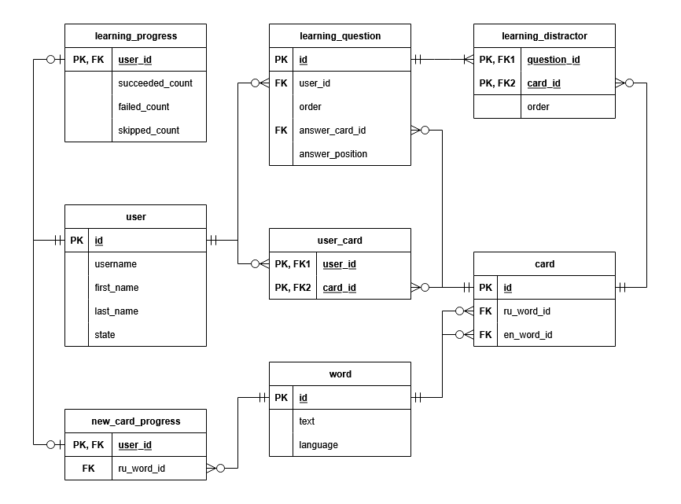

# *Telegram English Bot*: Telegram-бот для изучения английского языка

## Описание

Данный проект представляет собой Telegram-бот, предназначенный для более
удобного изучения английского языка. Обучение проходит в формате «вопрос-ответ»:

1. Есть слово на русском языке.
2. Требуется предложить его перевод.
3. У пользователя есть возможность добавлять новые слова для изучения.

Как выяснили британские учёные, регулярное повторение перевода слов с родного языка
на иностранный помогает лучше запомнить перевод! Предлагаю проверить это утверждение
на собственном опыте с помощью данного проекта!

## Поддерживаемые команды

### 1. /start

Начинает работу с ботом, выводит приветственное сообщение и краткую справку по
работе с ботом. После этого демонстрируется главное меню бота.

При повторном нажатии выводит краткое приветствие (без справки) и выводит в
главное меню. В таком режиме команда может использоваться как быстрый способ
прервать любой режим и выйти в главное меню.

### 2. /help

Выводит краткую справку о возможностях бота. После команды `/start` также
выводит главное меню.

### 3. /clear

Удаляет все данные пользователя, в том числе и все слова, которые
пользователь добавлял вручную. Данные не подлежат восстановлению, так что
следует соблюдать осторожность!

После выполнения данной команды можно выполнить команду `/start` - это будет
«свежий старт» только со словами из списка по умолчанию.

## Главное меню

### 📖 Учиться

Начинает сессию обучения. Для её начала требуется наличие как минимум 4-х
карточек в персональном словаре пользователя. Для всех новых пользователей
словарь заполняется словами из списка по умолчанию, который содержит
некоторое количество пар общеупотребительных русскоязычных и англоязычных
слов. Этого количество будет достаточно для начала обучения.

Процесс обучения происходит следующим образом:

1. Пользователю демонстрируется общее количество карточек, которые
будут участвовать в процессе обучения.
2. Пользователю демонстрируется слово на русском языке.
3. Пользователю даётся выбор:
    * 4 варианта перевода данного слова на английский язык. Лишь
один из вариантов ответа верный, при неудаче предлагается повторить попытку.
    * ⏩ Пропустить слово - пользователь может пропустить данное слово
в рамках текущей сессии обучения.
    * ❌ Удалить слово - пользователь может навсегда удалить данное слово
из своего персонального словаря. После этого удалённое слово больше не
будет участвовать в обучении для данного пользователя до момента повторного
добавления.
    * 🏁 Завершить - пользователь может преждевременно завершить сессию
обучения.
4. Процесс продолжается до исчерпания персонального словаря пользователя
либо до нажатия кнопки «🏁 Завершить».
5. После завершения сессии будет продемонстрирована итоговая статистика во
время сессии обучения.

### ✍🏻 Добавить новое слово

Переводит в режим добавления нового слова в персональный словарь пользователя:

1. Пользователю предлагается набрать на клавиатуре исходное слово на русском языке.
2. Проверяется корректность ввода пользователя: максимальная длина слова
составляет 64 символа. При некорректном вводе происходит возврат к шагу 1.
3. Далее пользователю предлагается набрать на клавиатуре перевод первого слова
на английский язык.
4. Проверяется корректность ввода пользователя: максимальная длина слова
составляет 64 символа. При некорректном вводе происходит возврат к шагу 3.
5. Новая карточка для обучения добавлена в персональный словарь пользователя
и будет использована в процессе обучения.

## Установка

Для работы проекта требуется установленного в системе интерпретатора Python
версии не старше 3.13, на более старых версиях стабильная работа не гарантируется.

Проект также имеет набор зависимостей, который описан в файле `requirements.txt`.
Все зависимости можно установить следующей командой:

```bash
pip install -r requirements.txt
```

Для установки зависимостей рекомендуется использовать виртуальное окружение Python
для того, чтобы исключить возможные конфликты версий между уже установленными
в системные каталоги и теми, от которых зависит проект.

## Запуск

После удовлетворения всех зависимостей бот запускается следующей командой:

```python
python main.py
```

Бот осуществляет логирование в поток стандартного вывода консоли.

Бот представляет собой утилиту командной строки без параметров.
Взамен, бот имеет конфигурационные параметры, которые можно задать
с помощью переменных окружения либо файла `.env` в корневой папке проекта.

Для удобства работы с файлом `.env` предусмотрен файл `.env.example`,
который является шаблоном для файла `.env` и содержит подробное
описание параметров программы.

Список конфигурационных параметров:

* `LOG_LEVEL` - уровень фильтрации сообщений логирования. Допустимы значения:
`FATAL`, `ERROR`, `WARNING`, `INFO`, `DEBUG`. По умолчанию - `INFO`.
* `TG_BOT_TOKEN` - токен бота, который использовать для работы с Telegram Bot API.
* `CLEAR_DATA` - Позволяет полностью очистить базу данных при запуске. Для этого
следует установить параметр в значение `True`. По умолчанию - `False`.
* `TEST_WORDS` - Позволяет в качестве списка слов по умолчанию использовать
уменьшенный тестовый список. Для этого следует установить параметр в значение
`True`. По умолчанию - `False`.
* `DB_DRIVER` - название драйвера и диалект для подключения к базе данных.
По умолчанию - `postgresql+psycopg2`.
* `DB_HOST` - имя узла сети либо IP-адрес, где развёрнута база данных.
По умолчанию - `localhost`.
* `DB_PORT` - номер порта для подключения к базу данных. По умолчанию - `5432`.
* `DB_NAME` - название существующей базы данных, к которой осуществить подключение.
По умолчанию - `english_tg_bot`.
* `DB_USER` - имя пользователя, который имеет права на создание и изменение таблиц в
базе данных. По умолчанию - `postgres`.
* `DB_PASS` - пароль пользователя для аутентификации в базе данных. По умолчанию - `postgres`.

## Технические детали

Данные бота сохраняются и извлекаются из базы данных. База данных устроена
согласно следующей диаграмме:


Данные сущности описаны с помощью ORM-отображений в модуле `model/types.py`.

Кодовая база бота разработана по принципу MVC - она состоит из четырёх логических частей:

* управление данными в базе данных (model)
* логика взаимодействия с Telegram Bot API (view)
* основная бизнес-логика (controller)
* логика инициализации и запуска приложения (application)

При возникновении серьёзных ошибок в работе бот будет отвечать сообщением «Ошибка работы бота».

### Стек использованных технологий

* Python 3.13
* pyTelegramBotAPI
* SQLAlchemy
* psycopg2
* Pydantic
* coloredlogs
